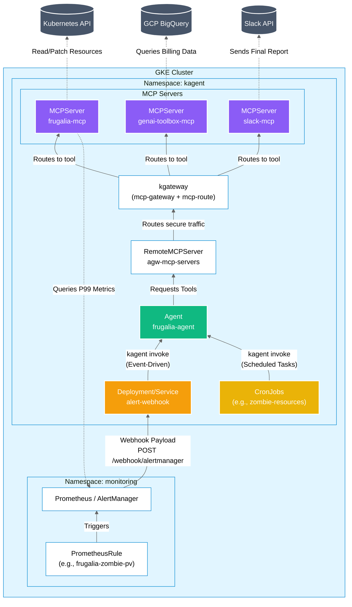

# Frugalia MCP

**Frugalia** is a GKE FinOps MCP (Model Context Protocol) server that enables AI agents to automatically identify and execute Kubernetes cost optimization opportunities.

## Overview

## Architecture



Frugalia empowers AI agents (deployed with [kagent](https://kagent.dev)) to analyze GKE clusters and recommend cost-saving actions:

1. **Rightsizing**: Reduce CPU/memory requests for over-provisioned workloads
2. **Zombie Detection**: Identify and remove unused resources (PVCs, PVs, LoadBalancers)
3. **Spot Migration**: Move stateless workloads to Spot instances for 60-70% savings

## Features

- Real-time Kubernetes API integration and Prometheus P99 usage metrics
- Safety-first: PodDisruptionBudget verification before Spot migrations
- Dual-MCP architecture with genai-toolbox (BigQuery billing) and Slack
- 8 MCP tools + 4 scheduled CronJobs + event-driven Prometheus AlertManager webhook

## Project Structure

```
frugalia-mcp/
├── src/
│   ├── tools/               # 8 MCP tools (analyze_rightsizing, detect_zombie_resources, etc.)
│   └── core/                # FastMCP server + Prometheus utils
├── kubernetes/
│   ├── cronjobs/            # 4 scheduled CronJobs (nightly FinOps workflows)
│   ├── prometheus-alerts/   # AlertManager PrometheusRules + alertmanager-values
│   ├── frugalia-agent.yaml  # kagent Agent definition
│   ├── frugalia-mcp.yaml    # MCPServer (frugalia-mcp)
│   ├── genai-toolbox-mcp.yaml # MCPServer (BigQuery billing) + ConfigMap/Secret
│   ├── slack-mcp.yaml       # MCPServer (Slack)
│   ├── rbac.yaml            # ClusterRole + ServiceAccount
│   ├── remotemcp.yaml       # RemoteMCPServer (agw-mcp-servers)
│   ├── gateway.yaml         # kgateway + MCPRoute
│   ├── backend.yaml         # Backend resources
│   ├── httproute.yaml       # HTTPRoute
│   └── trafficpolicy.yaml   # TrafficPolicy
├── event-driven-webhook/    # FastAPI webhook receiver for AlertManager
│   ├── main.py              # POST /webhook/alertmanager → kagent invoke
│   ├── Dockerfile           # Python 3.10 + kagent CLI
│   ├── requirements.txt
│   └── even-driver-webhook-deployment.yaml
├── kagent-cmd/              # Minimal image for CronJob invocations
│   └── Dockerfile           # Debian + kubectl + kagent CLI
├── .github/workflows/
│   └── docker-build.yaml    # CI/CD: build, scan (Trivy), push to Docker Hub
└── kmcp.yaml                # MCP configuration
```

## Docker Images

Three images are built and pushed to Docker Hub by the CI/CD pipeline:

| Image | Source | Description                            |
|---|---|----------------------------------------|
| `salvadorarreola/frugalia-mcp` | `Dockerfile` | FastMCP server: 8 K8s/Prometheus tools |
| `salvadorarreola/kagent-cmd` | `kagent-cmd/Dockerfile` | Minimal runner for CronJob invocations |
| `salvadorarreola/event-driven-webhook` | `event-driven-webhook/Dockerfile` | AlertManager webhook receiver          |

## CI/CD Pipeline

The GitHub Actions workflow (`.github/workflows/docker-build.yaml`) runs on version tags (`v*.*.*`, `b*.*.*`) or manual dispatch:

```
build (matrix: 3 images)
  └── scan (Trivy: filesystem vulns, misconfigs, secrets + image CRITICAL scan)
        └── push-dockerhub (matrix: 3 images) ← only on tags or main branch
```

- Builds are cached via GitHub Actions Cache (per-image scope)
- Images are passed between jobs as artifacts
- Push step requires `DOCKERHUB_USERNAME` and `DOCKERHUB_TOKEN` repository secrets

## Quick Start

### Local Development

```bash
# Install dependencies
uv sync

# Configure Prometheus
export PROMETHEUS_URL="http://localhost:9090"

# Run server
uv run python src/main.py
```

### Kubernetes Deployment

```bash
# Core components
kubectl apply -f kubernetes/rbac.yaml
kubectl apply -f kubernetes/frugalia-mcp.yaml
kubectl apply -f kubernetes/genai-toolbox-mcp.yaml
kubectl apply -f kubernetes/slack-mcp.yaml
kubectl apply -f kubernetes/remotemcp.yaml
kubectl apply -f kubernetes/gateway.yaml
kubectl apply -f kubernetes/frugalia-agent.yaml

# Scheduled CronJobs
kubectl apply -f kubernetes/cronjobs/

# Event-driven webhook
kubectl apply -f event-driven-webhook/even-driver-webhook-deployment.yaml

# Prometheus alerts
kubectl apply -f kubernetes/prometheus-alerts/

# Verify
kubectl get agent frugalia-agent -n kagent
kubectl get cronjobs -n kagent
kubectl get deployment alert-webhook -n kagent
kubectl logs -n kagent -l app=frugalia -f
```

## MCP Tools

**8 Core Tools:**

1. **`analyze_rightsizing`**: Analyzes CPU/memory usage vs requests (P99 over 7 days)
2. **`detect_zombie_resources`**: Finds unused PVCs, PVs, and LoadBalancers
3. **`identify_spot_candidates`**: Identifies stateless workloads safe for Spot migration
4. **`check_nodepool_types`**: Verifies Spot nodepool availability
5. **`check_node_utilization`**: Detects underutilized nodes for bin-packing optimization
6. **`get_kubernetes_resources`**: Queries K8s resources (pods, deployments, PDBs, etc.)
7. **`get_prometheus_metrics`**: Executes PromQL queries
8. **`apply_resource_patch`**: Applies K8s patches (requires approval)

## Scheduled CronJobs

Four CronJobs run nightly in the `kagent` namespace using the `salvadorarreola/kagent-cmd` image. All times are **America/Mexico_City**.

| CronJob | Schedule | Workflow                                                      |
|---|---|---------------------------------------------------------------|
| `frugalia-node-utilization` | `0 20 * * *` (8 PM) | Node utilization: bin-packing, underutilized node detection   |
| `frugalia-rightsizing-audit` | `0 21 * * *` (9 PM) | Rightsizing: over-provisioned deployments, CPU/memory savings |
| `frugalia-spot-migration` | `0 22 * * *` (10 PM) | Spot migration: Spot candidates, PDB safety, cost savings     |
| `frugalia-zombie-resources` | `0 23 * * *` (11 PM) | Zombie detection: unused PVCs, PVs, LoadBalancers, cleanup    |

Each CronJob invokes the `frugalia-agent` via `kagent invoke` and the agent sends a final report to Slack.

## Event-Driven Webhook

The `alert-webhook` deployment (`event-driven-webhook/`) receives POST requests from Prometheus AlertManager at `/webhook/alertmanager`. For each **firing** alert that contains an `action` annotation, it calls `kagent invoke` to trigger the `frugalia-agent`.

**Environment variables:**
- `KAGENT_URL`: kagent controller endpoint (default: `http://kagent-controller.kagent.svc:8083`)
- `AGENT_NAME`: target agent name (default: `frugalia-agent`)

**Prometheus AlertManager config (`alertmanager-values.yaml`):** points the receiver URL to `http://alert-webhook.kagent.svc/webhook/alertmanager`.

## AI Agent Workflows

**Workflow A: Spot Migration**: Identify stateless workloads and move to Spot nodes (60-70% savings). Verifies PDB safety and nodepool availability.

**Workflow B: Zombie Detection**: Find unused resources (PVCs, PVs, LoadBalancers), calculate costs, recommend cleanup with approval.

**Workflow C: Node Optimization**: Detect underutilized nodes, analyze bin-packing opportunities, target `kube:unallocated` costs in BigQuery billing.

All workflows integrate with BigQuery (genai-toolbox) for cost analysis and send reports to Slack.

## Configuration

**Environment Variable:**
- `PROMETHEUS_URL`: Prometheus server endpoint (default: `http://prometheus-kube-prometheus-prometheus.monitoring:9090`)

**RBAC Permissions** (see `kubernetes/rbac.yaml`):
- Read: pods, deployments, services, PVCs/PVs, nodes, PDBs, events, namespaces
- Write: deployments (patch/update/scale), services/PVCs/PVs (delete)

**Required Secrets:**
- `DOCKERHUB_USERNAME`/`DOCKERHUB_TOKEN`: Docker Hub push credentials (GitHub Actions)
- `genai-toolbox-variables`: BigQuery project/dataset/table config (Kubernetes Secret)

## Adding Custom Tools

```bash
kmcp add-tool my_custom_tool
# Edit src/tools/my_custom_tool.py with @mcp.tool() decorator
uv run pytest tests/
kmcp build && kubectl apply -f kubernetes/frugalia-mcp.yaml
```

## Development

```bash
# Local testing
kubectl port-forward -n monitoring svc/prometheus-kube-prometheus-prometheus 9090:9090
export PROMETHEUS_URL="http://localhost:9090"
uv run python src/main.py

# Build and deploy
docker build -t salvadorarreola/frugalia-mcp:latest .
docker build -t salvadorarreola/kagent-cmd:latest kagent-cmd/
docker build -t salvadorarreola/event-driven-webhook:latest event-driven-webhook/
```

## Troubleshooting

- **RBAC issues:** `kubectl get clusterrolebinding frugalia-mcp` and check service account
- **Prometheus failing:** Verify `PROMETHEUS_URL` in pod environment and test connectivity
- **Tools not loading:** Check `kubectl logs -n kagent -l app=frugalia-mcp`
- **Webhook not triggering:** Check `kubectl logs -n kagent -l app=alert-webhook` and verify AlertManager receiver URL
- **CronJob not running:** Check `kubectl get jobs -n kagent` and `kubectl describe cronjob <name> -n kagent`

## License

MIT
